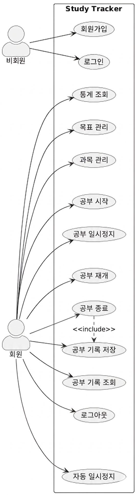
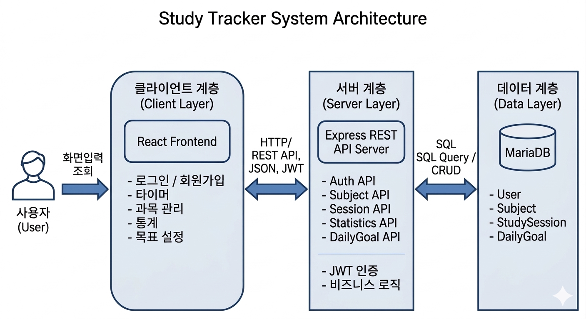
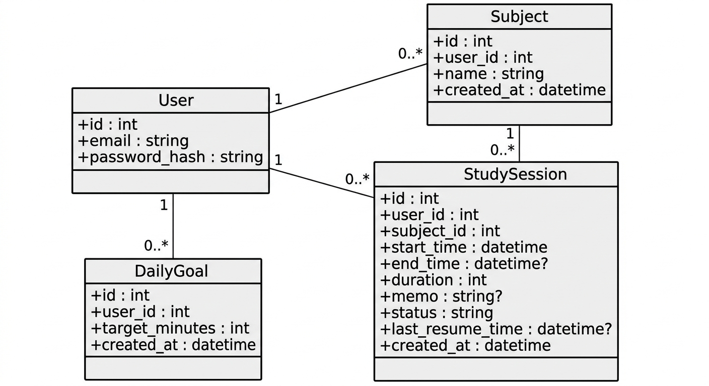
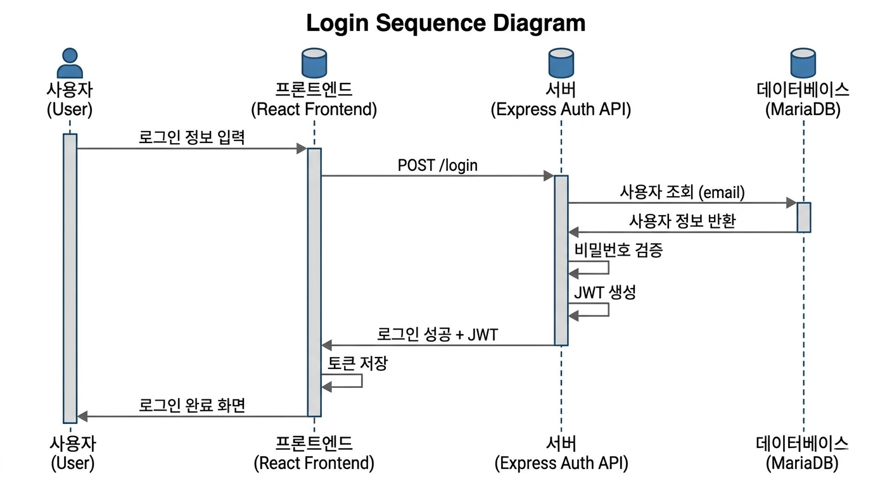
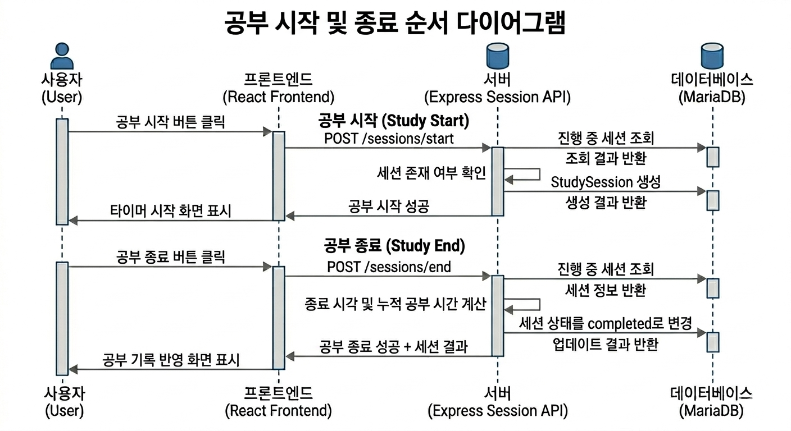
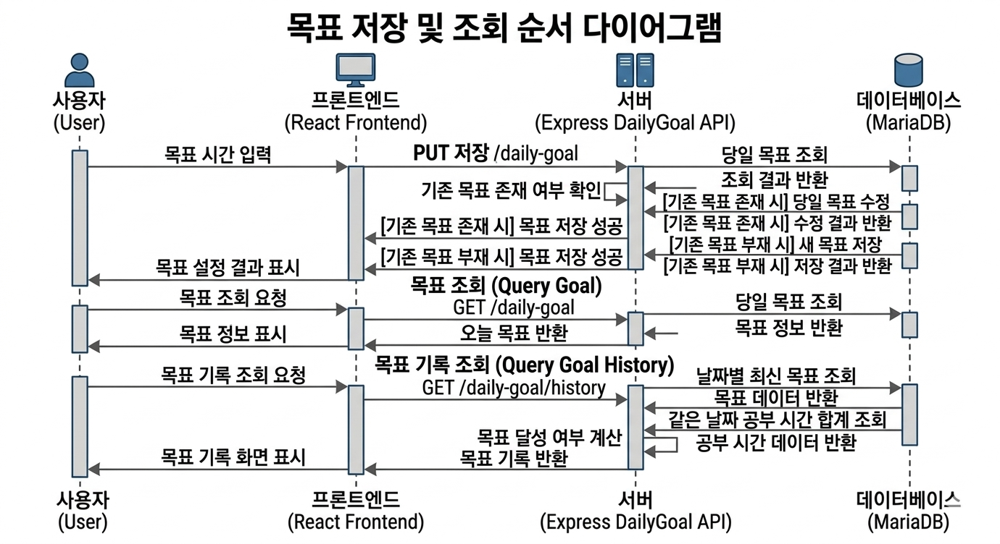
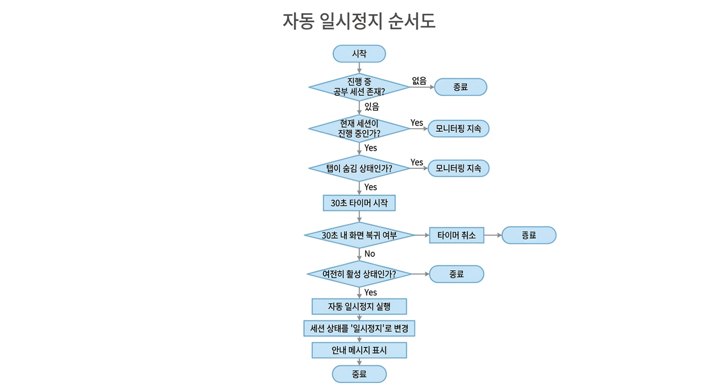
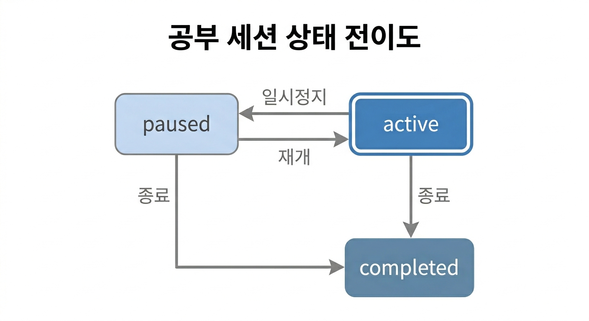

# Study Tracker 보고서 

Study Tracker는 PC 환경에서 학습 시간을 기록하고 시각화하여 사용자가 자신의 공부 패턴을 파악하고 꾸준히 학습할 수 있도록 돕는 웹 기반 학습 관리 시스템이다.

## 1. 실험의 목적과 범위

### 1.1 실험의 목적

본 프로젝트의 목적은 사용자의 공부 시간을 효율적으로 기록하고 관리할 수 있는 웹 기반 학습 관리 시스템을 구현하는 데 있다. 기존의 단순 타이머 기능에서 나아가, 공부 시작부터 일시정지, 재개, 종료까지의 흐름을 하나의 학습 세션으로 관리하고, 이를 데이터베이스에 저장하여 사용자가 자신의 학습 현황을 확인할 수 있도록 하는 것을 목표로 한다.

또한 기록된 학습 데이터를 바탕으로 일일 공부 시간, 최근 7일 학습 시간, 월별 히트맵 통계와 같은 시각화 기능을 제공하여 사용자가 자신의 공부 패턴을 직관적으로 파악할 수 있도록 한다. 추가적으로 오늘의 목표 공부 시간을 설정하고 달성 여부를 확인할 수 있는 기능을 통해 자기주도적인 학습 관리가 가능하도록 하는 데 목적이 있다.

### 1.2 실험의 범위

본 프로젝트에서는 다음과 같은 기능을 구현 범위에 포함하였다.

- 회원가입 및 로그인 기능
- JWT 기반 인증 처리
- 과목 생성, 조회, 삭제 기능
- 공부 타이머 시작, 일시정지, 재개, 종료 기능
- 공부 기록 저장 및 조회 기능
- 일일 통계, 최근 7일 통계, 월별 히트맵 통계 기능
- 오늘 목표 공부 시간 설정 및 최근 목표 달성 기록 조회 기능
- 탭 이탈 감지 및 자동 일시정지 기능
- 타이머 일시 정지시 알람 기능

다음 항목은 본 프로젝트의 구현 범위에서 제외하였다.

- 강제 화면 Lock 기능
- Fullscreen 기반 집중 모드
- 시간별 통계 및 학습패턴 시각화
- 과목별 상세 통계와 기간별 고급 필터링
- 배포 환경 구성 

## 2. 분석

### 2.1 기능 목록

본 시스템은 사용자 인증, 과목 관리, 공부 세션 관리, 통계 조회, 목표 관리, 집중 보조 기능으로 구성된다. 각 기능은 다음과 같다.

- 사용자 인증 기능
  - 회원가입
  - 로그인
- 과목 관리 기능
  - 과목 생성
  - 과목 목록 조회
  - 과목 삭제
- 공부 세션 관리 기능
  - 공부 시작
  - 공부 일시정지
  - 공부 재개
  - 공부 종료
  - 공부 기록 조회
- 통계 기능
  - 오늘 공부 시간 조회
  - 최근 7일 공부 시간 조회
  - 월별 공부 히트맵 조회
- 목표 관리 기능
  - 오늘 목표 공부 시간 설정
  - 오늘 목표 공부 시간 조회
  - 최근 목표 달성 기록 조회
- 집중 보조 기능
  - 탭 이탈 감지
  - 자동 일시정지
  - 자동 일시정지 시 알림 표시

### 2.2 유스케이스 다이어그램

아래 그림은 Study Tracker 시스템에서 비회원과 회원이 수행할 수 있는 주요 기능을 나타낸 유스케이스 다이어그램이다.



비회원은 회원가입과 로그인을 수행할 수 있으며, 회원은 로그인 이후 과목 관리, 공부 시작 및 종료, 기록 조회, 통계 조회, 목표 관리 등의 기능을 사용할 수 있다.

### 2.3 기능 명세

#### 1. 회원가입 및 로그인

- 목적: 사용자가 개인 계정을 생성하고 인증된 상태로 시스템 기능을 사용할 수 있도록 한다.
- 입력: 이메일, 비밀번호
- 처리 내용: 회원가입 시 이메일 형식과 비밀번호 길이를 확인한 뒤 비밀번호를 해시 처리하여 저장한다.
- 처리 내용: 로그인 시 입력한 이메일과 비밀번호를 DB 정보와 비교하여 사용자 인증을 수행한다.
- 결과: 로그인 성공 시 JWT 토큰이 발급되며, 이후 인증이 필요한 API 호출에 사용된다.
- 예외 처리: 입력값이 없거나 형식이 올바르지 않은 경우 요청을 거부하며, 인증 실패 시 보호 기능에 접근할 수 없다.

#### 2. 과목 관리

- 목적: 사용자가 공부 기록을 과목 단위로 구분하여 관리할 수 있도록 한다.
- 입력: 과목명
- 처리 내용: 사용자는 새로운 과목을 생성할 수 있으며, 생성된 과목은 사용자별로 구분되어 저장된다.
- 처리 내용: 사용자는 자신의 계정에 등록된 과목 목록을 조회할 수 있다.
- 처리 내용: 더 이상 사용하지 않는 과목은 삭제할 수 있다.
- 결과: 공부 시작 시 과목을 선택해 세션과 연결할 수 있다.
- 예외 처리: 빈 과목명이나 존재하지 않는 과목 삭제 요청은 허용되지 않는다.

#### 3. 공부 타이머

- 목적: 사용자의 공부 시간을 실시간으로 측정하고 하나의 학습 세션 단위로 기록한다.
- 입력: 선택한 과목, 메모
- 처리 내용: 사용자는 타이머를 시작하여 공부를 진행할 수 있으며, 필요에 따라 메모를 함께 기록할 수 있다.
- 처리 내용: 공부 도중 타이머를 일시정지하거나 재개할 수 있으며, 이 과정에서 누적 공부 시간이 갱신된다.
- 처리 내용: 타이머 종료 시 세션 상태를 완료 상태로 변경하고 최종 공부 시간을 저장한다.
- 결과: 종료된 세션은 공부 기록 목록과 통계 집계에 반영된다.
- 제약 조건: 진행 중인 세션은 사용자당 하나만 유지되며, 세션 상태는 진행중, 일시정지, 완료로 관리된다.

#### 4. 통계 및 시각화

- 목적: 저장된 공부 기록을 바탕으로 학습 현황을 직관적으로 확인할 수 있도록 한다.
- 입력: 사용자별 공부 기록 데이터, 조회 시점의 날짜 정보
- 처리 내용: 오늘 공부 시간 합계를 집계하여 일일 학습량을 제공한다.
- 처리 내용: 최근 7일 동안의 공부 시간을 집계하여 주간 학습 흐름을 확인할 수 있도록 한다.
- 처리 내용: 월별 공부 시간을 날짜 단위로 집계하여 히트맵 형식으로 시각화한다.
- 결과: 사용자는 메인화면과 통계 화면에서 일간, 주간, 월간 학습 현황을 확인할 수 있다.
- 제약 조건: 통계 데이터는 로그인한 사용자 본인의 공부 기록만을 기준으로 계산된다.

#### 5. 목표 설정

- 목적: 사용자가 하루 학습 목표를 설정하고 달성 여부를 확인할 수 있도록 한다.
- 입력: 목표 공부 시간(분)
- 처리 내용: 사용자는 오늘의 목표 시간을 분 단위로 저장하거나 수정할 수 있다.
- 처리 내용: 시스템은 해당 날짜의 실제 공부 시간과 목표 시간을 비교하여 달성 여부를 계산한다.
- 결과: 사용자는 오늘 목표와 최근 목표 기록, 달성 여부를 함께 확인할 수 있다.
- 제약 조건: 같은 날짜에 목표가 여러 번 수정된 경우 가장 최근 목표를 기준으로 기록을 조회한다.

#### 6. 집중 보조 기능

- 목적: 공부 중 불필요한 이탈을 줄이고 실제 학습 시간만 기록되도록 보조한다.
- 입력: 브라우저 탭 활성/비활성 상태
- 처리 내용: 사용자가 공부 중 브라우저 탭을 일정 시간 이상 벗어나면 자동 일시정지가 수행된다.
- 처리 내용: 자동 일시정지 발생 시 사용자에게 알림 메시지를 표시한다.
- 결과: 집중이 끊긴 구간이 공부 시간에 과도하게 포함되지 않도록 관리할 수 있다.

## 3. 설계

### 3.1 시스템 구조 설계

본 시스템은 클라이언트-서버 구조를 기반으로 설계하였다. 사용자는 React 기반 프론트엔드에서 화면을 통해 기능을 수행하고, 프론트엔드는 Express 서버의 REST API를 호출하여 데이터를 처리한다. 서버는 요청에 대한 인증 처리, 비즈니스 로직 수행, 데이터베이스 연동을 담당하며, 모든 기록 데이터는 MariaDB에 저장된다.

아래 그림은 본 프로젝트의 전체 시스템 구조를 나타낸다.



시스템 구조는 크게 다음 세 부분으로 구분된다.

- 클라이언트 계층: React 기반 사용자 인터페이스
- 서버 계층: Express 기반 API 서버
- 데이터 계층: MariaDB 기반 학습 기록 저장소

### 3.2 클래스 다이어그램

본 프로젝트는 객체지향 클래스 중심 구조보다는 데이터 중심의 웹 서비스 구조이므로, 클래스 다이어그램은 핵심 도메인 엔티티와 데이터 관계를 중심으로 설계하였다. 핵심 클래스는 `User`, `Subject`, `StudySession`, `DailyGoal` 4개로 구성된다.



각 클래스의 역할은 다음과 같다.

- `User`
  - 사용자 계정 정보를 저장한다.
  - 주요 속성: `id`, `email`, `password_hash`
- `Subject`
  - 사용자별 과목 정보를 저장한다.
  - 주요 속성: `id`, `user_id`, `name`, `created_at`
- `StudySession`
  - 공부 시작 시각, 종료 시각, 누적 시간, 메모, 상태 정보를 저장한다.
  - 주요 속성: `id`, `user_id`, `subject_id`, `start_time`, `end_time`, `duration`, `memo`, `status`, `last_resume_time`, `created_at`
- `DailyGoal`
  - 사용자별 하루 목표 공부 시간을 저장한다.
  - 주요 속성: `id`, `user_id`, `target_minutes`, `created_at`

클래스 간 관계는 다음과 같다.

- `User` 1 : N `Subject`
- `User` 1 : N `StudySession`
- `User` 1 : N `DailyGoal`
- `Subject` 1 : N `StudySession`

단, `StudySession`의 `subject_id`는 선택값이므로 과목을 지정하지 않은 공부 세션도 생성할 수 있다.

### 3.3 순서 다이어그램

순서 다이어그램은 사용자의 주요 기능 수행 과정에서 프론트엔드, 백엔드, 데이터베이스가 어떤 순서로 상호작용하는지를 설명하기 위해 작성하였다. 각 순서 다이어그램은 사용자 요청이 프론트엔드, 백엔드, 데이터베이스를 거쳐 처리되는 과정을 시간 순서에 따라 나타낸다.

#### 3.3.1 로그인 순서 다이어그램

사용자가 로그인 정보를 입력하면 프론트엔드가 로그인 API를 호출하고, 서버는 DB에서 사용자 정보를 조회한 후 비밀번호를 검증한다. 검증이 완료되면 JWT 토큰을 생성하여 프론트엔드에 반환하고, 프론트엔드는 이를 저장하여 이후 인증 요청에 사용한다.

로그인 성공 후 프론트엔드는 발급받은 JWT 토큰을 저장하고, 이후 인증이 필요한 API 요청의 `Authorization` 헤더에 포함하여 전송한다.



#### 3.3.2 공부 시작 및 종료 순서 다이어그램

사용자가 공부 시작 버튼을 누르면 프론트엔드는 공부 시작 API를 호출하고, 서버는 현재 진행 중인 세션 존재 여부를 확인한 뒤 새로운 `StudySession`을 생성한다. 사용자가 공부를 종료하면 서버는 종료 시각과 누적 공부 시간을 계산하여 세션 상태를 `completed`로 변경하고, 결과를 반환한다.

공부 시작 시 서버는 이미 진행 중인 세션이 있는지 확인하여 중복 세션 생성을 방지한다. 또한 공부 종료 시에는 세션 상태와 누적 시간을 반영하여 최종 공부 기록을 저장한다.



#### 3.3.3 목표 저장 및 조회 순서 다이어그램

사용자가 목표 시간을 입력하면 프론트엔드는 목표 저장 API를 호출한다. 서버는 해당 날짜의 목표 존재 여부를 확인한 후 새로운 목표를 저장하거나 기존 목표를 수정한다. 이후 목표 조회 또는 기록 조회 시에는 날짜별 최신 목표와 실제 공부 시간을 함께 계산하여 반환한다.

목표 저장 시 서버는 해당 날짜에 기존 목표가 존재하는지 확인한 뒤, 있으면 수정하고 없으면 새로 저장한다. 목표 기록 조회 시에는 날짜별 최신 목표와 실제 공부 시간을 비교하여 목표 달성 여부를 계산한다.



### 3.4 순서도

순서도는 특정 기능이 조건 분기와 상태 변화에 따라 어떻게 동작하는지 설명하기 위해 작성하였다.

#### 3.4.1 자동 일시정지 순서도

자동 일시정지 기능은 사용자가 공부 중일 때 브라우저 탭을 벗어나면 작동한다. 탭이 비활성화된 상태가 일정 시간 이상 유지될 경우 시스템은 현재 세션을 자동으로 일시정지하고 사용자에게 알림을 표시한다.



#### 3.4.2 공부 세션 상태 전이 순서도

공부 세션은 `active`, `paused`, `completed` 세 가지 상태를 기준으로 관리된다. 사용자는 시작 후 일시정지와 재개를 반복할 수 있으며, 최종적으로 종료 시 완료 상태로 전환된다.



상태 전이 흐름은 아래와 같다.

```text
active -> paused -> active -> completed
active -> completed
```

### 3.5 알고리즘 설계

본 프로젝트에서는 단순 CRUD 처리 외에도 실제 학습 흐름을 반영하기 위한 상태 관리와 데이터 보정 로직이 필요하였다. 따라서 알고리즘 설계에서는 자동 일시정지, 공부 시간 누적 계산, 목표 기록 조회, 중복 세션 방지 로직을 중심으로 정리하였다.

#### 3.5.1 자동 일시정지 알고리즘

자동 일시정지 기능은 브라우저의 탭 가시성 변화를 감지하여 실제 학습 시간만 기록하도록 설계하였다.

```text
1. 사용자가 현재 공부 중인지 확인한다.
2. 브라우저 탭이 숨김 상태로 바뀌면 대기 타이머를 시작한다.
3. 일정 시간(30초) 이상 탭을 벗어난 상태가 유지되면 자동 일시정지를 수행한다.
4. 현재 세션의 상태를 paused로 변경하고 누적 시간을 저장한다.
5. 사용자에게 자동 일시정지 알림 메시지를 표시한다.
```

#### 3.5.2 공부 세션 시간 계산 알고리즘

공부 세션의 누적 시간은 시작 시각부터 종료 시각까지 단순 계산하지 않고, 일시정지와 재개 구간을 반영하여 계산하도록 설계하였다.

```text
1. 공부 시작 시 세션 상태를 active로 저장한다.
2. 일시정지 시 마지막 재개 시각부터 현재 시각까지의 차이를 계산한다.
3. 계산된 시간을 기존 duration에 누적한다.
4. 재개 시 last_resume_time을 현재 시각으로 갱신한다.
5. 종료 시 active 상태였다면 마지막 활성 구간 시간을 추가 계산한다.
6. 최종 duration을 저장하고 상태를 completed로 변경한다.
```

#### 3.5.3 목표 기록 조회 알고리즘

목표 기록 조회 기능은 같은 날짜에 여러 번 목표가 수정될 수 있다는 점을 고려하여 날짜별 최신 목표를 기준으로 설계하였다.

```text
1. DailyGoal 테이블에서 날짜별 최신 목표를 찾는다.
2. 같은 날짜의 StudySession 공부 시간 합계를 계산한다.
3. 목표 시간과 실제 공부 시간을 비교해 달성 여부를 계산한다.
4. 최근 기록 순으로 정렬하여 반환한다.
```

#### 3.5.4 진행 중 세션 중복 방지 알고리즘

공부 타이머 기능에서는 한 사용자가 동시에 여러 개의 진행 중 세션을 가지지 않도록 제약을 두었다. 이를 통해 실제 학습 흐름과 다른 중복 기록 생성을 방지하도록 설계하였다.

```text
1. 사용자가 공부 시작 요청을 보낸다.
2. 서버는 해당 사용자의 StudySession 중 end_time이 없고 status가 active 또는 paused인 세션이 존재하는지 조회한다.
3. 진행 중 세션이 존재하면 새로운 세션 생성 요청을 거부한다.
4. 진행 중 세션이 없을 경우에만 새로운 StudySession을 생성한다.
5. 생성된 세션은 active 상태로 저장하고 이후 일시정지, 재개, 종료 흐름에 따라 관리한다.
```

## 4. 구현

### 4.1 구현 환경

- 운영체제: Windows 기반 개발 환경
- 프론트엔드 개발 도구: React, react-scripts
- 백엔드 개발 도구: Node.js, Express
- 데이터베이스: MariaDB
- 서버 구조: 클라이언트(React) / 서버(Express) / DB(MariaDB)

### 4.2 개발 언어 및 라이브러리

- 프론트엔드: JavaScript, React, React Router
- 백엔드: JavaScript, Node.js, Express
- 인증: `jsonwebtoken`, `bcrypt`
- DB 연동: `mysql2`
- 기타: `cors`

### 4.3 프로젝트 구조

```text
study_tracker_pj/
├─ backend/
│  ├─ middleware/    # JWT 인증 미들웨어
│  ├─ routes/        # 인증, 과목, 세션, 통계, 목표 관련 API 라우트
│  ├─ scripts/       # 보조 스크립트
│  ├─ db.js          # MariaDB 연결 및 StudySession 스키마 보정
│  ├─ package.json
│  └─ server.js      # Express 서버 진입점
├─ frontend/
│  ├─ src/
│  │  ├─ api/        # 백엔드 API 호출 함수
│  │  ├─ components/ # 공통 UI 컴포넌트
│  │  ├─ pages/      # 화면 단위 페이지 컴포넌트
│  │  ├─ utils/      # 시간 포맷 등 공통 유틸
│  │  ├─ App.js      # 라우팅 구성
│  │  └─ index.js    # React 앱 시작점
│  └─ package.json
└─ README.md
```

- `backend/routes/auth.js` : 회원가입, 로그인 처리
- `backend/routes/subject.js` : 과목 생성, 조회, 삭제 처리
- `backend/routes/session.js` : 공부 시작, 일시정지, 재개, 종료, 기록 조회 처리
- `backend/routes/statistics.js` : 일간 통계, 주간 통계, 히트맵 통계 처리
- `backend/routes/dailyGoal.js` : 오늘 목표 저장, 조회, 목표 히스토리 조회 처리
- `frontend/src/pages/DashboardPage.js` : 메인화면 및 월별 히트맵 표시
- `frontend/src/pages/TimerPage.js` : 공부 타이머 및 자동 일시정지 기능
- `frontend/src/pages/StatisticsPage.js` : 일일/주간 통계 화면
- `frontend/src/pages/DailyGoalPage.js` : 목표 설정 및 목표 기록 화면

### 4.4 주요 화면 설명

스크린샷은 `docs/screenshots/` 경로 기준으로 정리할 수 있다.

#### 1. 메인화면

- 오늘 공부 시간, 오늘 목표, 현재 공부 상태를 한눈에 확인할 수 있는 화면이다.
- 월별 공부 캘린더 히트맵을 통해 날짜별 학습량을 확인할 수 있다.


#### 2. 공부 타이머 화면

- 공부 시작, 일시정지, 재개, 종료를 수행하는 핵심 화면이다.
- 과목 선택과 메모 입력이 가능하며, 탭 이탈 시 자동 일시정지 기능이 동작한다.


#### 3. 목표 설정 화면

- 오늘의 목표 공부 시간을 분 단위로 설정할 수 있다.
- 최근 목표 기록과 달성 여부를 함께 확인할 수 있다.


#### 4. 통계 화면

- 오늘 공부 시간과 최근 7일 평균 공부 시간을 확인할 수 있다.
- 최근 7일 학습량을 차트 형태로 비교할 수 있다.


### 4.5 사용 흐름

1. 회원가입 또는 로그인을 진행한다.
2. 과목 관리 화면에서 공부할 과목을 생성한다.
3. 공부 타이머 화면으로 이동해 과목을 선택하고 공부를 시작한다.
4. 공부 중에는 메모를 작성하고 필요에 따라 일시정지 또는 재개할 수 있다.
5. 브라우저 탭을 일정 시간 이상 벗어나면 자동 일시정지 기능이 동작한다.
6. 공부를 마치면 타이머를 종료하고, 공부 기록은 자동으로 저장된다.
7. 메인화면과 통계 화면에서 오늘 공부 시간, 최근 7일 학습량, 월별 히트맵을 확인한다.
8. 목표 설정 화면에서 오늘 목표 공부 시간을 설정하고 최근 목표 달성 여부를 확인한다.

### 4.6 주요 API

인증이 필요한 API를 호출할 때는 로그인 후 발급받은 JWT 토큰을 `Authorization` 헤더에 포함해야 한다.

#### 인증(Auth)

- `POST /register` : 회원가입
- `POST /login` : 로그인

#### 과목 관리(Subject)

- `GET /subjects` : 과목 목록 조회
- `POST /subjects` : 과목 생성
- `DELETE /subjects/:id` : 과목 삭제

#### 공부 세션(Study Session)

- `POST /sessions/start` : 공부 시작
- `POST /sessions/pause` : 공부 일시정지
- `POST /sessions/resume` : 공부 재개
- `POST /sessions/end` : 공부 종료
- `GET /sessions` : 공부 기록 조회

#### 통계(Statistics)

- `GET /statistics/daily` : 오늘 공부 시간 조회
- `GET /statistics/weekly` : 최근 7일 공부 시간 조회
- `GET /statistics/heatmap?year=YYYY&month=M` : 월별 공부 시간 히트맵 조회

#### 목표 공부시간(Daily Goal)

- `GET /daily-goal` : 오늘 목표 공부 시간 조회
- `PUT /daily-goal` : 오늘 목표 공부 시간 설정
- `GET /daily-goal/history` : 최근 목표 달성 기록 조회

## 5. 실험

### 5.1 테스트 데이터

| 항목 | 입력 데이터 | 목적 |
| --- | --- | --- |
| 회원가입 | 이메일, 비밀번호 | 사용자 계정 생성 확인 |
| 로그인 | 등록된 이메일, 비밀번호 | JWT 발급 확인 |
| 과목 생성 | 예: 자료구조, 운영체제 | 과목 저장 확인 |
| 공부 시작 | 과목 선택, 메모 입력 | 세션 생성 확인 |
| 공부 일시정지/재개 | 타이머 동작 중 버튼 입력 | 상태 전이 확인 |
| 공부 종료 | 종료 버튼 입력 | 기록 자동 저장 확인 |
| 목표 설정 | 예: 120분 | 목표 저장 및 조회 확인 |
| 통계 조회 | 여러 날짜의 세션 데이터 | 일간/주간/월간 집계 확인 |

### 5.2 테스트 결과

| 테스트 항목 | 기대 결과 | 실제 결과 |
| --- | --- | --- |
| 회원가입 | 새 계정이 생성된다. | 정상 동작 |
| 로그인 | JWT 토큰이 발급된다. | 정상 동작 |
| 과목 생성 | 과목이 DB에 저장된다. | 정상 동작 |
| 공부 시작 | 세션이 active 상태로 저장된다. | 정상 동작 |
| 일시정지 | 세션 상태가 paused로 변경된다. | 정상 동작 |
| 재개 | 세션 상태가 active로 복귀한다. | 정상 동작 |
| 종료 | 세션 상태가 completed로 저장된다. | 정상 동작 |
| 자동 일시정지 | 탭 이탈 후 자동 pause가 수행된다. | 정상 동작 |
| 목표 설정 | 오늘 목표 시간이 저장된다. | 정상 동작 |
| 통계 조회 | 일간/주간/히트맵 데이터가 조회된다. | 정상 동작 |

### 5.3 실험 보완 사항

- 현재 테스트는 주로 수동 기능 테스트 중심으로 수행하였다.
- Jest, React Testing Library, API 테스트 도구를 이용한 자동화 테스트는 추가 작성이 필요하다.

## 6. 결론

### 6.1 작업 결과

- 회원 인증, 과목 관리, 공부 타이머, 목표 설정, 통계 조회 기능을 포함한 학습 관리 시스템을 구현하였다.
- 공부 세션을 `active`, `paused`, `completed` 상태로 관리하여 실제 학습 흐름을 반영하였다.
- 탭 이탈 감지와 자동 일시정지 기능을 추가하여 집중 학습 보조 기능을 구현하였다.
- 메인화면, 타이머 화면, 통계 화면, 목표 설정 화면을 통해 사용자가 학습 현황을 쉽게 확인할 수 있도록 구성하였다.

### 6.2 한계점 및 향후 개선 사항

- Fullscreen 집중 모드와 과목별 상세 통계는 아직 구현되지 않았다.
- 테스트 코드와 배포 환경 구성이 미완성 상태이다.
- DB 접속 정보가 코드에 직접 작성되어 있어, 향후 `.env` 기반 환경 변수 분리가 필요하다.
- 통계 시각화를 더 다양하게 확장하고, 필터링 기능을 추가할 수 있다.
