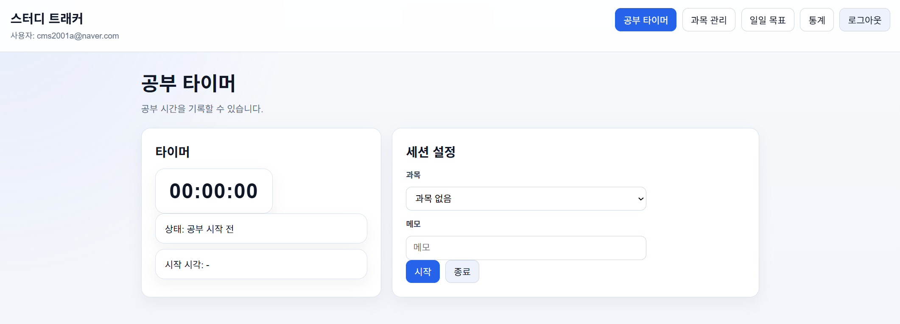
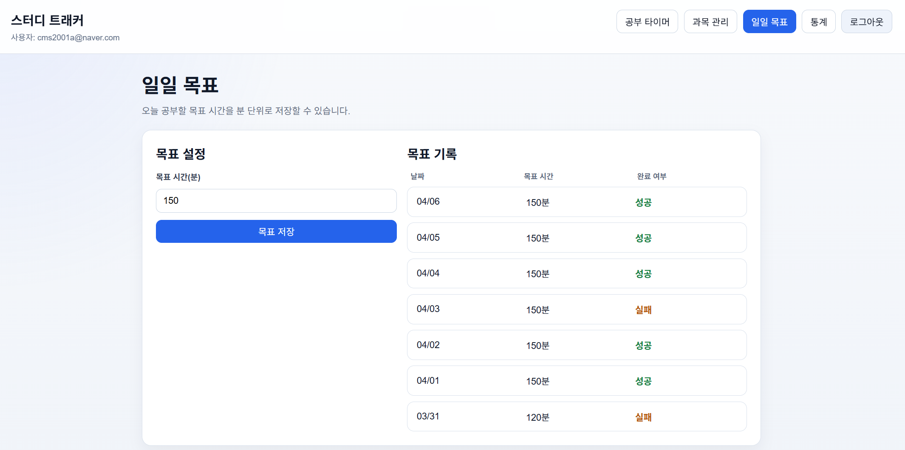
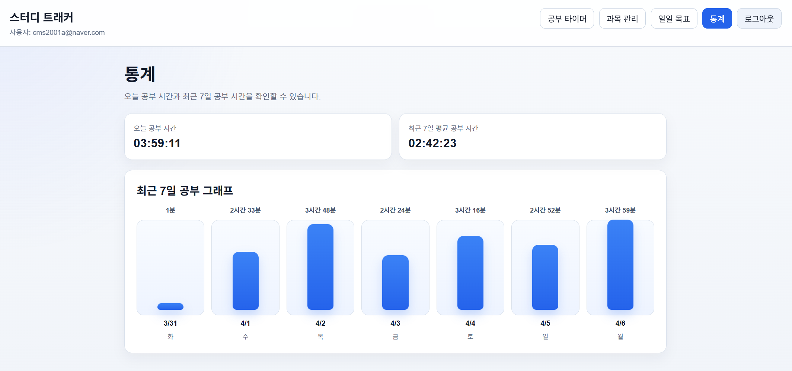

# Study Tracker

Study Tracker는 PC 환경에서 학습 시간을 기록하고 시각화하여 사용자가 자신의 공부 패턴을 파악하고 꾸준히 학습할 수 있도록 돕는 웹 기반 학습 관리 시스템입니다.

## 기술 스택

- Backend: Node.js, Express
- Frontend: React, React Router
- Database: MariaDB
- Authentication: JWT, bcrypt
- DB Driver: mysql2

## 프로젝트 구조

```text
study_tracker_pj/
├─ backend/
│  ├─ middleware/    # JWT 인증 미들웨어
│  ├─ routes/        # 인증, 과목, 세션, 통계, 목표 관련 API 라우트
│  ├─ scripts/       # DB 구조 보정용 스크립트
│  ├─ db.js          # MariaDB 연결 및 StudySession 스키마 보정
│  ├─ package.json
│  └─ server.js      # Express 서버 진입점
├─ frontend/
│  ├─ src/
│  │  ├─ api/        # 백엔드 API 호출 함수
│  │  ├─ components/ # 공통 UI 컴포넌트
│  │  ├─ pages/      # 화면 단위 페이지 컴포넌트
│  │  ├─ utils/      # 시간 포맷 등 공통 유틸
│  │  ├─ App.js      # 라우팅 구성
│  │  └─ index.js    # React 앱 시작점
│  └─ package.json
└─ README.md
```

- `backend/routes/auth.js` : 회원가입, 로그인 처리
- `backend/routes/subject.js` : 과목 생성, 조회, 삭제 처리
- `backend/routes/session.js` : 공부 시작, 일시정지, 재개, 종료, 기록 조회 처리
- `backend/routes/statistics.js` : 일간 통계, 주간 통계, 히트맵 통계 처리
- `backend/routes/dailyGoal.js` : 오늘 목표 저장, 조회, 목표 히스토리 조회 처리
- `frontend/src/pages/DashboardPage.js` : 메인 대시보드 및 월별 히트맵 화면
- `frontend/src/pages/TimerPage.js` : 공부 타이머 및 자동 일시정지 기능 화면
- `frontend/src/pages/StatisticsPage.js` : 일일/주간 통계 화면
- `frontend/src/pages/DailyGoalPage.js` : 오늘 목표 설정 및 최근 목표 기록 화면

## 구현된 기능

현재까지 다음 기능이 구현되어 있습니다.

- 회원가입 / 로그인 API
- JWT 기반 인증 미들웨어
- 인증 사용자 전용 보호 라우트
- 과목(Subject) 관리
  - 과목 생성
  - 과목 목록 조회
  - 과목 삭제
- 공부 세션(StudySession) 관리
  - 공부 시작
  - 공부 일시정지
  - 공부 재개
  - 공부 종료
  - 공부 기록 조회
  - 과목 선택 후 세션 시작
  - 세션별 메모 입력
  - 진행 중인 세션 1개만 유지하도록 제한
  - 진행중 / 일시정지 / 완료 상태 관리
- 통계(Statistics)
  - 일일 공부시간 통계 조회
  - 최근 7일 공부시간 통계 조회
  - 월별 공부시간 히트맵 조회
- Daily Goal 관리
  - 오늘 목표 공부시간 설정
  - 오늘 목표 공부시간 조회
  - 최근 목표 달성 기록 조회
- React 프론트엔드 UI
  - 메인 대시보드
  - 로그인 / 회원가입 화면
  - 공부 타이머 화면
  - 과목 관리 화면
  - 공부 기록 조회 화면
  - 통계 화면
  - 오늘 목표 공부시간 설정 화면
  - 월별 공부 캘린더 히트맵
  - 최근 7일 통계 차트
  - 목표 달성 히스토리 표시
- 사용자 집중 보조 기능
  - 탭 비활성화 감지
  - 일정 시간 동안 화면을 벗어나면 자동 일시정지
  - 브라우저 알림 표시

현재 백엔드의 핵심 API와 프론트엔드 주요 화면이 연결된 상태이며, 인증이 필요한 API는 JWT 토큰 기반으로 보호되고 있습니다.

## 주요 화면 설명

스크린샷은 `docs/screenshots/` 경로 기준으로 정리할 수 있습니다.

### 1. 메인 대시보드

- 오늘 공부 시간, 오늘 목표, 현재 공부 상태를 한눈에 확인할 수 있는 메인 화면입니다.
- 월별 공부 캘린더 히트맵을 통해 날짜별 학습량을 시각적으로 확인할 수 있습니다.


### 2. 공부 타이머 화면

- 공부 시작, 일시정지, 재개, 종료를 수행하는 핵심 화면입니다.
- 과목 선택과 메모 입력이 가능하며, 탭 이탈 시 자동 일시정지 기능이 동작합니다.



### 3. 목표 설정 화면

- 오늘의 목표 공부 시간을 분 단위로 설정할 수 있습니다.
- 최근 목표 기록과 달성 여부를 함께 확인할 수 있습니다.



### 4. 통계 화면

- 오늘 공부 시간과 최근 7일 평균 공부 시간을 확인할 수 있습니다.
- 최근 7일 학습량을 차트 형태로 비교할 수 있습니다.



## 사용 흐름

1. 회원가입 또는 로그인을 진행합니다.
2. 과목 관리 화면에서 공부할 과목을 생성합니다.
3. 공부 타이머 화면으로 이동해 과목을 선택하고 공부를 시작합니다.
4. 공부 중에는 필요에 따라 메모를 작성하고, 일시정지 또는 재개할 수 있습니다.
5. 브라우저 탭을 일정 시간 이상 벗어나면 자동 일시정지 기능이 동작합니다.
6. 공부를 마치면 세션을 종료하고 기록을 저장합니다.
7. 메인 대시보드와 통계 화면에서 오늘 공부 시간, 최근 7일 학습량, 월별 히트맵을 확인합니다.
8. 목표 설정 화면에서 오늘 목표 공부 시간을 설정하고 최근 목표 달성 여부를 확인합니다.

## DB 구조 및 마이그레이션

프로젝트는 MariaDB를 사용하며, 학습 기록과 사용자 데이터를 테이블 단위로 관리합니다.

- `User` : 사용자 계정 정보 저장
  - 주요 컬럼: `id (PK)`, `email`, `password_hash`
- `Subject` : 사용자별 과목 정보 저장
  - 주요 컬럼: `id (PK)`, `user_id (FK -> User.id)`, `name`, `created_at`
- `StudySession` : 공부 세션 기록 저장
  - 주요 컬럼: `id (PK)`, `user_id (FK -> User.id)`, `subject_id (FK -> Subject.id)`, `start_time`, `end_time`, `duration`, `memo`, `status`, `last_resume_time`, `created_at`
- `DailyGoal` : 날짜별 목표 공부 시간 저장
  - 주요 컬럼: `id (PK)`, `user_id (FK -> User.id)`, `target_minutes`, `created_at`

테이블 관계는 `User`를 기준으로 `Subject`, `StudySession`, `DailyGoal`이 연결되는 구조이며, `StudySession`은 필요할 때 `Subject`와 연결됩니다.

`StudySession` 테이블은 공부 흐름을 관리하기 위해 진행중, 일시정지, 완료 상태를 사용합니다.
`subject_id`는 선택값이므로 과목 없이 공부 세션을 기록하는 것도 가능합니다.

`DailyGoal`은 사용자별 목표 시간을 저장하며, 목표 기록 조회 시에는 날짜별 최신 목표를 기준으로 최근 기록을 보여줍니다.

현재 구조에서는 별도의 수동 마이그레이션 명령어 대신, 서버가 DB에 연결될 때 `backend/db.js`에서 `StudySession` 테이블의 `status`, `last_resume_time` 컬럼을 자동으로 확인하고 필요한 경우 보정합니다.

## 주요 API

인증이 필요한 API를 호출할 때는 로그인 후 발급받은 JWT 토큰을 Authorization 헤더에 포함해야 합니다.

### 인증 (Auth)
- `POST /register` : 회원가입
- `POST /login` : 로그인

### 과목 관리 (Subject)
- `GET /subjects` : 과목 목록 조회
- `POST /subjects` : 과목 생성
- `DELETE /subjects/:id` : 과목 삭제

### 공부 세션 (Study Session)
- `POST /sessions/start` : 공부 시작
- `POST /sessions/pause` : 공부 일시정지
- `POST /sessions/resume` : 공부 재개
- `POST /sessions/end` : 공부 종료
- `GET /sessions` : 공부 기록 조회

### 통계 (Statistics)
- `GET /statistics/daily` : 오늘 공부시간 조회
- `GET /statistics/weekly` : 최근 7일 공부시간 조회
- `GET /statistics/heatmap?year=YYYY&month=M` : 월별 공부시간 히트맵 조회

### 목표 공부시간 (Daily Goal)
- `GET /daily-goal` : 오늘 목표 공부시간 조회
- `PUT /daily-goal` : 오늘 목표 공부시간 설정
- `GET /daily-goal/history` : 최근 목표 달성 기록 조회

## 미구현 기능

현재 아래 기능들은 아직 구현되지 않았거나, 추후 보완이 필요한 항목입니다.

- 집중 모드 전용 화면 고도화
- Fullscreen 학습 모드
- 과목별 상세 통계 및 기간별 필터링
- 통계 시각화의 추가 고도화
- 테스트 코드 작성
- 환경 변수 분리 및 배포 환경 설정 정리
- 개인 서버 또는 클라우드 환경에서의 최종 배포 및 통합 점검
